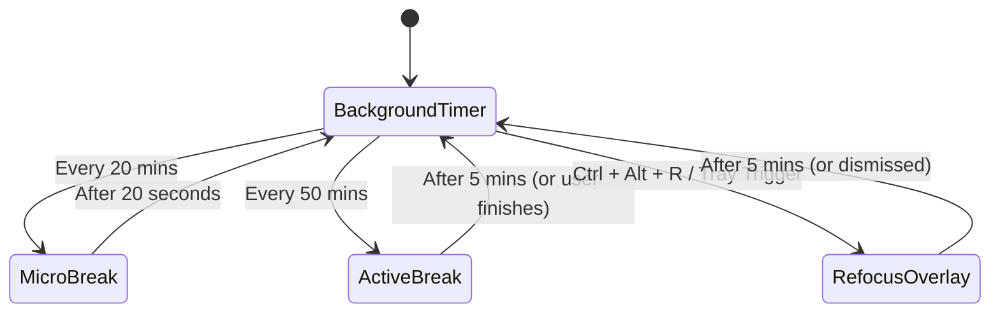

# AI Handoff & Technical Guide: Workout & Break Reminder (Cognitive Companion)

**Last Updated**: 2026-08-04
**Last Tracked Commit**: `0c9e811` - Add dynamic JSON metadata extension to state and flashcards

### Recent Commits History:
* `0c9e811` - Add dynamic JSON metadata extension to state and flashcards (2026-08-04)
* `4073027` - Update dev issue reporter to modular GitHub Dark version (2026-08-03)
* `777cdbf` - Remove redundant header from active recall card (2026-08-03)
* `38cc4fd` - Add robust image fallback chain for exercise card (2026-08-03)
* `53ca854` - Improve dev issue reporter with React Fiber metadata and props (2026-08-03)

---

## 🚀 1. Repository Context & Purpose

The **Workout & Break Reminder** (also referred to as the **Cognitive Companion**) is a lightweight native desktop application designed for software engineers. Its purpose is to break up intense coding sessions, prevent eye strain, promote physical mobility, and facilitate active recall study blocks directly within a developer's flow state.

- **Target Audience**: Developers, engineers, power-users.
- **Tone & Feeling**: High-performance, technical, uncompromising, precise.
- **Primary Source Files for Context**:
  - [`CONTEXT.md`](file:///E:/00_HeadQuaters/50_Projects/Workout%20reminder_v2/CONTEXT.md): Main functional overview and glossary.
  - [`AGENTS.md`](file:///E:/00_HeadQuaters/50_Projects/Workout%20reminder_v2/AGENTS.md): Developer commands and guidelines.
  - [`DESIGN.md`](file:///E:/00_HeadQuaters/50_Projects/Workout%20reminder_v2/DESIGN.md): Design system design specifications.
  - [`README.md`](file:///E:/00_HeadQuaters/50_Projects/Workout%20reminder_v2/README.md): Readme overview.
  - [`todo.md`](file:///E:/00_HeadQuaters/50_Projects/Workout%20reminder_v2/todo.md): Current task list.

---

## 🛠️ 2. Technical Stack & Architecture

The application is built on a modern hybrid native stack:

- **Backend**: **Tauri v2 + Rust**
  - Manages background timer loops (using tokio) so timers stay accurate when the window is hidden.
  - Intercepts global keyboard shortcuts (e.g., `Ctrl + Alt + R`) via the global shortcut plugin.
  - Controls OS window states (hiding, showing, putting always-on-top, and toggling click-through).
  - Performs local file I/O to save config/flashcard databases.
- **Frontend**: **React (Vite) + Vanilla CSS Modules**
  - A Single Page Application (SPA) driven by state hooks.
  - Styled strictly with **CSS Modules** (`*.module.css`) for component-specific styles to keep class names scoped.
  - Communicates with the Rust backend via Tauri IPC (`invoke`).

### Key Code Paths:
- **Rust Setup & Tauri Entrypoint**: [`src-tauri/src/lib.rs`](file:///E:/00_HeadQuaters/50_Projects/Workout%20reminder_v2/src-tauri/src/lib.rs)
- **Rust Backend State Management**: [`src-tauri/src/core/state.rs`](file:///E:/00_HeadQuaters/50_Projects/Workout%20reminder_v2/src-tauri/src/core/state.rs)
- **Tauri Commands**: [`src-tauri/src/commands/`](file:///E:/00_HeadQuaters/50_Projects/Workout%20reminder_v2/src-tauri/src/commands/)
- **Frontend Entrypoint**: [`src/main.jsx`](file:///E:/00_HeadQuaters/50_Projects/Workout%20reminder_v2/src/main.jsx)
- **Frontend Controller**: [`src/App.jsx`](file:///E:/00_HeadQuaters/50_Projects/Workout%20reminder_v2/src/App.jsx)
- **Frontend Core Stylesheet**: [`src/styles.css`](file:///E:/00_HeadQuaters/50_Projects/Workout%20reminder_v2/src/styles.css) (Global variables, resets, layout structure).

---

## 🔄 3. Core Concepts & State Machine

The system transitions between background monitoring and several overlay break states:

### 1. Cycle Overview
- **Micro-Break**: Toggles every **20 minutes** for **20 seconds**. Dimmed, absolute-black screen overlay. Focuses on eye health (20-20-20 rule). No cognitive load.
- **Active Break**: Toggles every **50 minutes** for **5 minutes**. Centered layout featuring two columns:
  - **Left**: Guided stretching and posture adjustment routines (driven by track configurations).
  - **Right**: Active Recall Flashcards (questions with toggleable answers).
- **Refocus Break**: On-demand overlay triggered via the system-wide shortcut **`Ctrl + Alt + R`** or the system tray. A 5-minute rubber-ducking dashboard featuring reflection prompts and a markdown text log for journaling.

### 2. State Machine Diagram

---

## 🎨 4. Obsidian Kinetic Design System

All user interfaces must strictly adhere to the guidelines laid out in [`DESIGN.md`](file:///E:/00_HeadQuaters/50_Projects/Workout%20reminder_v2/DESIGN.md).

### Colors & Themes
- **Surface / Background**: Obsidian Black (`#121414`)
- **Primary Interactive Accents**: Ignition Orange (`#ff5c00`) / Dim Primary (`#ffb59a`)
- **Success / Telemetry States**: Terminal Green (`#00e639`)
- **Borders & Lines**: Low-contrast outlines (e.g., 10% white or muted charcoals) instead of drop-shadows.

### Typography
- **Primary Sans Font**: **Geist** (used for titles, headings, and description blocks).
- **Technical/Telemetry Font**: **JetBrains Mono** (used for timers, status indicators, statistics, labels, and code snippets).

### Layout & Borders
- **8px Grid**: Spacing units should be multiples of 8px (or 4px for fine alignments).
- **Border Radii**: Approchable pill-shaped architecture.
  - Buttons & Inputs: `1rem` base border-radius.
  - Status/Chips: Fully rounded (`rounded-xl` / `3rem` / `9999px`).
  - Panels/Containers: Large containers use `2rem` (`rounded-lg`) padding and corner radii.

---

## 📝 5. Coding Constraints (Critical Rules)

When writing code in this repository, you **MUST** follow these developer conventions:

### Frontend (React/CSS)
1. **NO Tailwind CSS**: The project does not use Tailwind for production styling. All styles must use **Vanilla CSS Modules** (`*.module.css`) co-located with their React components.
2. **Minimalist Global CSS**: Avoid adding styles to [`src/styles.css`](file:///E:/00_HeadQuaters/50_Projects/Workout%20reminder_v2/src/styles.css) unless they are application-wide tokens, CSS custom properties, or resets.
3. **Tabular Numbers for Timers**: Always use `font-variant-numeric: tabular-nums` (or CSS equivalent) to prevent numeric text from layout-shifting the countdown timer (see [ADR 0001](file:///E:/00_HeadQuaters/50_Projects/Workout%20reminder_v2/docs/adr/0001-tabular-nums-for-timer-display.md)).

### Backend (Rust/Tauri)
1. **No `.unwrap()`**: AVOID unwrap statements. Handle all potential failures gracefully via `Result` and propagate errors using Rust's `?` operator.
2. **Lean Invoke Commands**: Do not implement extensive application states or business logic inside Tauri commands. Tauri command files (in [`src-tauri/src/commands/`](file:///E:/00_HeadQuaters/50_Projects/Workout%20reminder_v2/src-tauri/src/commands/)) should act purely as bridge functions that delegate execution to the core state module ([`AppState`](file:///E:/00_HeadQuaters/50_Projects/Workout%20reminder_v2/src-tauri/src/core/state.rs)).
3. **Asynchronous Window Manipulation**: Never manipulate Tauri windows directly inside synchronous event handlers (e.g., blocking system tray events). Always execute window state transitions asynchronously to prevent thread deadlocks on Windows (see [ADR 0002](file:///E:/00_HeadQuaters/50_Projects/Workout%20reminder_v2/docs/adr/0002-async-window-manipulation-from-tray.md)).

### Data & Configuration Schemas
- Workouts, splits, and training data structures must match predefined specs. Always validate data structure modifications against:
  - [`docs/schemas/training-program.schema.json`](file:///E:/00_HeadQuaters/50_Projects/Workout%20reminder_v2/docs/schemas/training-program.schema.json) for program splits.
  - [`docs/reference/physical-tracks-spec.md`](file:///E:/00_HeadQuaters/50_Projects/Workout%20reminder_v2/docs/reference/physical-tracks-spec.md) for workout structures.

---

## 🛠️ 6. Dev Commands Cheat Sheet

- **Install Dependencies**: `npm install`
- **Run Developer Server**: `npm run tauri dev`
- **Compile Production Application**: `npm run tauri build`
- **Compile Rust Backend**: `cargo build` (within [`src-tauri/`](file:///E:/00_HeadQuaters/50_Projects/Workout%20reminder_v2/src-tauri/))
- **Check Backend Correctness**: `cargo check` (within [`src-tauri/`](file:///E:/00_HeadQuaters/50_Projects/Workout%20reminder_v2/src-tauri/))

---

## 📌 7. Developer & Issue Workflows

- **Local Issue Tracker**: Issues and specifications are maintained locally. The application features a Rust Tauri command [`create_dev_issue`](file:///E:/00_HeadQuaters/50_Projects/Workout%20reminder_v2/src-tauri/src/commands/dev_cmds.rs#L4-L15) that exports developer issues into the local `issues/` directory as markdown files.
- **GitHub Issue Tracker**: GitHub issues are used as the canonical tracker. Refer to the pipeline spec [`docs/agents/issue-tracker.md`](file:///E:/00_HeadQuaters/50_Projects/Workout%20reminder_v2/docs/agents/issue-tracker.md) to understand wayfinding, child ticket mapping, and issue triaging commands.
- **Domain vocabulary**: Consult [`docs/agents/domain.md`](file:///E:/00_HeadQuaters/50_Projects/Workout%20reminder_v2/docs/agents/domain.md) for mapping codebase terminology. Always respect glossary names defined in `CONTEXT.md` to avoid nomenclature misalignment.

