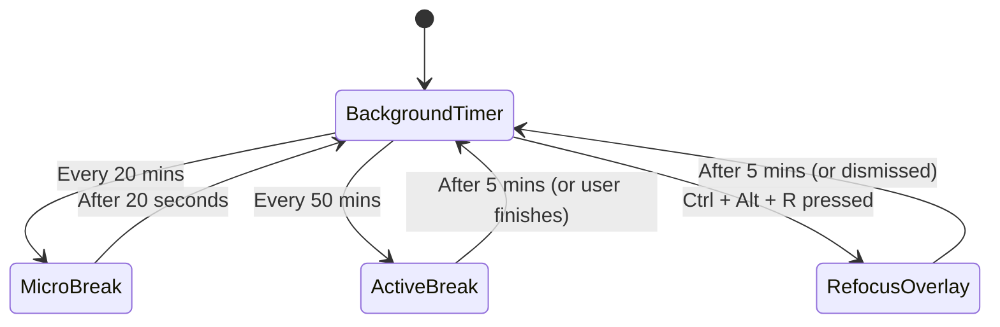

# Context: Workout & Break Reminder (Cognitive Companion)

A lightweight native desktop application (**Tauri + Rust + HTML/CSS/JS**) that acts as a cognitive companion for developers. It alternates between eye-health micro-breaks, active study/stretching breaks, and provides an on-demand "Refocus" overlay.

## Core Concepts & Glossary

### 1. Break Rhythm Cycles
- **Micro-Break**: A short 20-second pause occurring every 20 minutes to prevent eye strain (following the 20-20-20 rule). The screen dims to absolute black with zero text or cognitive distractions, forcing the user to look away.
- **Active Break**: A 5-minute break occurring every 50 minutes for physical stretching and cognitive reset.
- **On-Demand "Refocus" Break**: An instant 5-minute cognitive reset overlay triggered globally via the system shortcut **`Ctrl + Alt + R`**. It provides a "rubber-ducking" prompts overlay when the user is stuck or frustrated.

### 2. Cognitive reset & Study tools
- **Reflection Prompts**: High-level alignment questions (e.g. *"What is the core problem you are solving right now? Is there a simpler way?"*) designed to break hyperfocus rabbit holes.
- **Active Recall Cards**: Flashcards displaying custom learning prompts (e.g., Rust, design patterns) backed by user-editable markdown/JSON files.
- **Physical resets**: Guided stretching and posture adjustment cues.

## Technical Architecture

- **Backend (Rust + Tauri)**:
  - Manages background timers and application state.
  - Registers global hotkeys (`Ctrl + Alt + R`).
  - Triggers window events to show, hide, overlay, and dim screens.
  - Reads/writes plain text markdown/JSON configuration files for prompts and cards.
- **Frontend (HTML/CSS/JS)**:
  - Implements the **Obsidian Kinetic** styling system (Ignition Orange accents, Obsidian charcoal background, Geist & JetBrains Mono typography).
  - Displays overlay overlays, active timers, recall prompts, and physical stretches.

## State Machine

