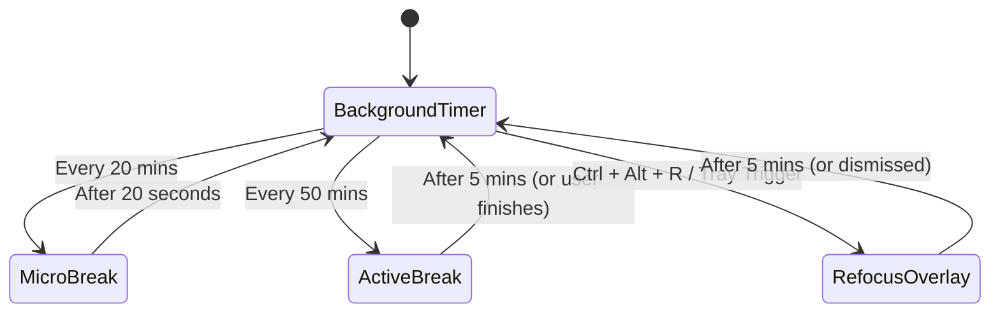

# Context: Kodon (Cognitive Companion)

A lightweight native desktop application (**Tauri + Rust + React + Vanilla CSS Modules**) that acts as a cognitive companion for software engineers. It balances eye-health micro-breaks, physical stretch intervals, on-demand refocus exercises, and flashcard learning directly inside the developer's workflow.

---

## 🔄 Core Concepts & Glossary

### 1. Cycle Overview & States
- **Micro-Break**: Toggles every **20 minutes** for **20 seconds**. Dimmed, absolute-black screen overlay. Focuses on eye health (20-20-20 rule). No cognitive load.
- **Active Break**: Toggles every **50 minutes** for **5 minutes**. Centered layout featuring two columns:
  - **Left**: Guided stretching and posture adjustment routines (driven by track configurations).
  - **Right**: Active Recall Flashcards (questions with toggleable answers).
- **Refocus Break**: On-demand overlay triggered via the system-wide shortcut **`Ctrl + Alt + R`** or the system tray. A 5-minute rubber-ducking dashboard featuring reflection prompts and a markdown text log for journaling.
- **Daily Accountability Check-in**: An optional, user-enabled daily check-in that blocks application access upon startup/rollover until a customizable Yes/No question is answered. Spec details are documented in [Daily Accountability Check-in](file:///E:/00_HeadQuaters/50_Projects/Workout%20reminder_v2/docs/behind-the-scenes/daily-accountability.md).

### 2. State Machine Diagram

### 3. Cognitive Reset & Study Tools
- **Reflection Prompts**: High-level alignment questions designed to break hyperfocus rabbit holes.
- **Active Recall Cards**: Flashcards displaying custom learning prompts managed in SQLite, scheduled via the Free Spaced Repetition Scheduler (FSRS), with optional topic-level prioritization (starring).
- **Physical Resets**: Guided stretching and posture adjustment cues.

---

## 🛠️ Technical Stack & Architecture

- **Backend (Rust + Tauri v2)**:
  - Tracks background timers via tokio threads so countdowns remain accurate when the window is hidden.
  - Registers global hotkeys (`Ctrl + Alt + R`).
  - Controls OS window states (hiding, showing, putting always-on-top, and toggling click-through).
  - Performs local file I/O to save config/flashcard databases.
- **Frontend (React 18 + Vite + CSS Modules)**:
  - Single Page Application (SPA) driven by state hooks.
  - Styled strictly with **CSS Modules** (`*.module.css`) for component-specific scoping.
  - Communicates with the Rust backend via Tauri IPC (`invoke`).

### Data & Configuration Schemas
- **Training Program Schema**: Located at [`docs/schemas/training-program.schema.json`](file:///E:/00_HeadQuaters/50_Projects/Workout%20reminder_v2/docs/schemas/training-program.schema.json).
- **SQLite Database Schema**: Spec in [`docs/agents/database-schema.md`](file:///E:/00_HeadQuaters/50_Projects/Workout%20reminder_v2/docs/agents/database-schema.md).
- **Workout Config Schema**: Spec in [`docs/reference/physical-tracks-spec.md`](file:///E:/00_HeadQuaters/50_Projects/Workout%20reminder_v2/docs/reference/physical-tracks-spec.md#L28-L124).
- **Dynamic Metadata Extension**: Supports type-flexible JSON metadata on core models (`ActiveRecallCard`, `Stretch`, `PhysicalTrack`) via `metadata: Option<serde_json::Value>` to support UI prototyping without schema migrations.

---

## 📌 Developer & Issue Workflows

- **Local Issue Tracker**: Issues/PRDs live in `docs/agents/issue-tracker.md`.
- **Domain Vocabulary**: Domain glossary lives in `docs/agents/domain.md`.
- **Architectural Decisions**:
  - [ADR 0001: Tabular Numbers for Timer Display](file:///E:/00_HeadQuaters/50_Projects/Workout%20reminder_v2/docs/adr/0001-tabular-nums-for-timer-display.md)
  - [ADR 0002: Async Window Manipulation from System Tray Events](file:///E:/00_HeadQuaters/50_Projects/Workout%20reminder_v2/docs/adr/0002-async-window-manipulation-from-tray.md)
