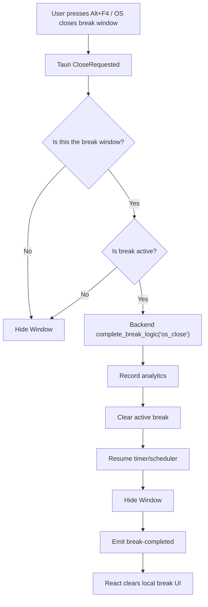

# Fix Native Window Close During Active Breaks

## Summary

When a user closes the active break overlay using `Alt + F4` or another OS-level window close mechanism, the application must treat the close as a break skip.

The backend will perform the authoritative break-completion state transition directly. It will record the skip reason, clear the active break, resume the timer, and then notify the React frontend of the completed transition.

This avoids making timer recovery dependent on the frontend receiving and processing an IPC event.

---

## Problem Frame

### Current state

* `src-tauri/src/lib.rs` intercepts `tauri::WindowEvent::CloseRequested`.
* The current handler prevents the native close and calls `window.hide()`.
* When the break overlay is active, this hides the UI without completing the backend break.
* The backend remains in a paused/active-break state because `complete_break` is not invoked.
* React is also left with stale active-break state.
* The timer can therefore remain paused indefinitely until the user manually reopens the application and completes the stale break.

### User pain

A native close action can silently corrupt the break lifecycle:

```text
Active break
    ↓
Alt + F4
    ↓
Overlay disappears
    ↓
Backend still considers break active
    ↓
Timer remains paused
    ↓
Future reminders stop
```

### Root cause

The native window lifecycle and the break lifecycle are currently independent.

The window can disappear without executing the backend state transition required to end the break.

---

## Goals

* Treat `CloseRequested` on an active break overlay as a skip.
* Make Rust the authoritative owner of the break completion transition.
* Resume the timer without depending on React.
* Record the skip reason as an analytics event.
* Notify React after the backend state transition has completed.
* Keep normal window closing behavior unchanged when no active break is being displayed.
* Make break completion safe against duplicate requests/events.

---

## Non-goals

* Redesigning the accountability flow.
* Changing snooze/pause tray behavior.
* Changing `SkipReasonModal`.
* Changing the SQLite schema unless the existing analytics API cannot represent an OS-close reason.
* Blocking or disabling native OS close behavior.
* Reworking the entire timer scheduler.

---

## Requirements

### R1 — Native close skips an active break

When `CloseRequested` is received for the active break overlay, the backend must treat it as a skip with reason `os_close`.

### R2 — Timer recovery is backend-authoritative

After an OS-close skip:

```text
current_break_state == None
timer_paused == false
```

The timer/scheduler must continue toward the next break without frontend participation.

### R3 — Analytics are recorded exactly once

An active-break OS close must record one skip event using the existing analytics conventions and the reason `os_close`.

### R4 — React is synchronized after completion

After the backend completes the break, React must receive a completion/state-change event and clear its local active-break UI state.

React must not be responsible for causing the backend state transition.

### R5 — Normal window close remains unchanged

Closing Settings, Dashboard, or another non-break window must hide the window without creating a skip event or changing timer state.

### R6 — Break completion is idempotent

If multiple completion paths race, the backend must not:

* record duplicate analytics events,
* resume/pause the timer incorrectly,
* emit contradictory state,
* panic because the break has already completed.

### R7 — Native close applies to the break window only

The active-break check must be scoped to the relevant break overlay/window.

Closing another application window must not accidentally skip an active break.

---

## Backend State Ownership

Rust is the authoritative owner of:

* active break lifecycle,
* timer pause/resume state,
* break completion,
* persistence/analytics,
* scheduler continuity.

React owns:

* presentation,
* local UI state,
* user-initiated commands,
* rendering backend state changes.

The architectural rule is:

> Backend state transitions must not depend on the frontend being alive or responsive.

---

## Key Technical Decision

### Backend-first state transition

Do not implement:

```text
CloseRequested
→ emit force-skip
→ React
→ invoke complete_break
→ Rust
```

Instead:

```text
CloseRequested
→ Rust completes break
→ Rust resumes timer
→ Rust records analytics
→ Rust hides window
→ Rust emits break-completed
→ React resets UI
```

This makes the native event authoritative and prevents a frontend IPC failure from reproducing the original stuck-timer bug.

---

## Break Completion Architecture

The existing break completion behavior will be reused (via `complete_break_logic` on `AppState`). 

Conceptually:

```text
complete_break_logic(reason)
```

performs the authoritative state transition:

1. Acquire the relevant break state.
2. Determine whether a break is currently active.
3. Record the completion/skip analytics event.
4. Clear the active break state.
5. Resume the timer/scheduler.
6. Return the completion result.

Both user and native-close paths will use this backend implementation.

### User skip

```text
React
  ↓
invoke("complete_break", reason)
  ↓
Rust complete_break_logic()
```

### Native OS close

```text
Tauri CloseRequested
  ↓
Rust complete_break_logic("os_close")
```

---

## Event Contract

We will emit a post-transition event:

```text
break-completed
```

The event will communicate that the backend has already completed the transition.

### Event semantics

`break-completed` means:

> The backend has already cleared the active break and resumed the timer. The frontend should synchronize its UI.

It must **not** mean:

> Frontend, please complete this break.

---

# High-Level Data Flow



---

# Component Architecture

```text
Workout reminder_v2/
├── src-tauri/
│   └── src/
│       ├── lib.rs (CloseRequested handler)
│       └── commands/timer_cmds.rs (existing commands)
│
└── src/
    └── App.jsx
```

---

# Implementation Units

## U1. Extract/verify backend break completion

**Goal:** Establish one authoritative and idempotent backend operation for ending a break.

**Requirements:** R2, R3, R6.

**Files:**

* `src-tauri/src/core/state.rs` (verify `complete_break_logic`)

### Approach

1. Verify `complete_break_logic` is fully extracted and idempotent.
2. Ensure both the Tauri command and native close path use the same backend implementation.

## U2. Update native `CloseRequested` handling

**Goal:** Convert native close of the active break overlay into a backend skip.

**Requirements:** R1, R5, R7.

**Files:**

* `src-tauri/src/lib.rs`

### Approach

1. In the `CloseRequested` handler, identify the window that generated the event.
2. Retrieve `AppState`.
3. Determine whether the break is active.
4. If the break is active:

   * call `state.complete_break_logic("skipped: os_close", None, None)`,
   * prevent native destruction,
   * hide the window,
   * emit the post-transition `break-completed` event.
5. If no break is active:

   * preserve the existing `prevent_close()` + `hide()` behavior.

## U3. Synchronize React after backend completion

**Goal:** Make React reflect the backend's completed break.

**Requirements:** R4.

**Files:**

* `src/App.jsx`

### Approach

1. Register a listener for `break-completed`.
2. Clear the active break UI state and preload the next flashcard (`triggerBreak()`).
3. Ensure the callback does not invoke `complete_break` again.

---

# Final Design Principle

> **Once Rust receives a native close request for an active break, the application must be able to recover its timer and break state without any dependency on the React frontend.**
