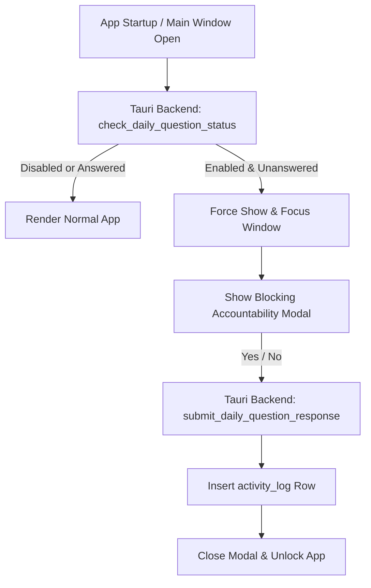

# Behind the Scenes: Daily Accountability Check-in

The **Daily Accountability Check-in** is an optional, user-enabled commitment device designed to prompt the user once per local calendar day with a customizable Yes/No question (default: **"Have you read the book of king?"**).

When enabled, it acts as a **blocking barrier**: the application window forces itself visible and focused on computer startup, blocking access to all other features until the user logs their daily commitment response.

---

## Technical Architecture & Lifecycle

### 1. Startup & Day Rollover Enforcement
* **PC Startup / Application Boot**: The Tauri backend setup hook reads the configuration during initialization. If `daily_prompt_enabled` is true, it queries the local database to see if a check-in has been logged for the current logical date (`YYYY-MM-DD`). If unanswered, it immediately forces the main webview window to show (`window.show()`) and focus (`window.set_focus()`), regardless of default window visibility settings.
* **Logical Date Calculation**: Instead of boundary rollover occurring at calendar midnight (`00:00`), the application relies on a configurable **Day Start Time** (persisted in settings as minutes since midnight; default is **4:00 AM** / `240` minutes). Any local wall-clock time before this setting falls into the previous logical accountability day.
* **Refocus / Open Triggers**: Whenever the main window gains focus or changes visibility (e.g. opened from the system tray), the frontend checks status again with the backend. If the logical day rolled over since the last answer and the check-in is enabled, the blocking modal overlays the interface.

### 2. Blocking Modal UI & Settings Priority
* The overlay acts as a complete modal trap. Escape key press and clicks outside the dialog are ignored and blocked.
* The user must select **YES** or **NO**.
* The modal remains visible and locked until the response is successfully written and confirmed by the local SQLite database.
* **Settings Priority / Override**: A settings gear icon on the blocking modal allows the user to open the Settings screen immediately. While the Settings Modal is open, the blocking Daily Accountability modal is temporarily hidden (suppressed) and unmounted. Once Settings is closed, if the daily check-in is still pending, the modal is immediately restored and becomes blocking again. Opening or closing Settings never skipper, skips, or records a response.

### 3. Database Persistence
Responses are persisted in the SQLite database to enable analytics, streaks, and exports:

* **Settings Storage**: The `settings` table stores:
  - `daily_prompt` (TEXT)
  - `daily_prompt_enabled` (INTEGER)
  - `day_start_time` (INTEGER): Day start boundary represented in minutes since midnight (e.g., `240` for `04:00`).
* **Logs Storage**: Responses are inserted into the `activity_log` table under:
  - `event_type`: `"daily_question"`
  - `occurred_at`: Unix timestamp (milliseconds) representing the actual submission time (preserving exact submission history).
  - `local_date`: The calculated logical date (`YYYY-MM-DD`).
  - `reference_id`: The logical date (`YYYY-MM-DD`), serving as a unique constraint index to prevent duplicate logging on the same day.
  - `metadata`: JSON payload, e.g. `{"response": "yes"}` or `{"response": "no"}`.

---

## Configuration & Management
The check-in can be configured, enabled, or disabled at any time under **Settings -> General**:

* **Toggle Checkbox**: Enables or disables the check-in. Enabling prompts the user with a confirmation dialog explaining the blocking behavior.
* **Custom Question Input**: Allows customizing the prompt text displayed in the modal overlay.
* **Day Start Time Selection**: Allows configuring the logical boundary hour (`12:00 AM` through `11:00 PM` in 1-hour increments) using a drop-down menu.

