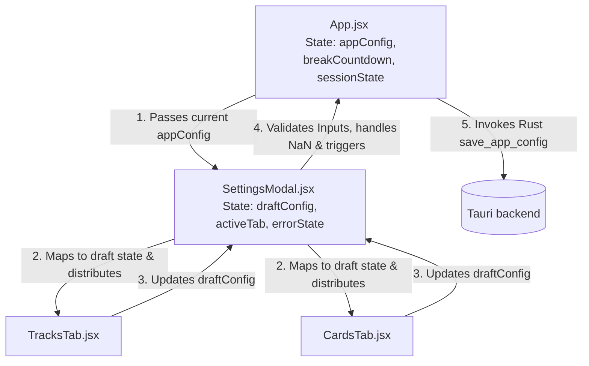

# Modularize Frontend Application

## Summary

Currently, the React frontend of the Workout & Break Reminder app consists of a single monolithic file, `src/App.jsx`, spanning over 1,350 lines of code. It contains all state variables, helper utilities, custom animation frame handlers, visual templates, settings logic, and CRUD sub-features. 

This feature will decompose `src/App.jsx` into separate, single-responsibility modules: React components for each section/modal, a custom hook for the "hold-to-confirm" timer animation, and specialized utility files (including a centralized Tauri IPC helper). This will improve readability, maintainability, performance, and testability while preventing typical refactoring regressions (such as stale state closures, async listener race conditions, NaN configuration corruptions, or browser-blocking layout freezings).

***

## Problem Frame

### Current state
- The entire frontend UI (break countdown header, physical reset card, active recall card, hold-to-skip button, settings dialog with 6 tabs, track onboarding panel, and skip reason prompt) is defined in a single component in `src/App.jsx`.
- State and refs are centralized, making local component changes hard to manage without affecting other parts of the system.
- Utility functions like time formatting and complex track validations are mixed in with component logic.
- Updating form states inside settings tabs triggers full-page re-renders of the timers and main layout components, causing wasteful CPU overhead.
- Asynchronous Tauri listeners are registered inside `useEffect` without managing the lifecycle of the returned unresolved promises, leading to listener memory leaks on unmount.
- Raw browser dialogs (`alert()`, `confirm()`) are used, which block the JavaScript single thread on desktop environments.

### User pain
- Adding new features or tweaking styling in one tab of the settings menu requires navigating a massive component, increasing risk of bugs.
- Changes to the active recall UI or physical stretch display are coupled, complicating code reviews.
- Lack of reuse makes onboarding new developers or AI agents slower.
- Running or debugging the app in a standard browser is difficult due to unmocked Tauri globals.
- Entering invalid or blank text inside numeric configuration inputs can produce `NaN` values, causing silent serialization crashes in Rust's backend deserializer.

### Why now
- As the app evolves with richer features (like custom progression tracks, active tier adjustments, and skip reason logs), the file is becoming difficult to manage and prone to build and merge conflicts.

***

## Goals

- Decompose `src/App.jsx` into lightweight components under `src/components/`, `src/hooks/`, and `src/utils/`.
- Ensure all functionality, designs, and styles remain 100% identical to the original app, complying with `DESIGN.md` (Obsidian Kinetic style).
- Optimize React rendering behavior: limit form state updates to the boundaries of the Settings Modal.
- Avoid heavy external state management libraries (Redux, MobX) or over-engineered solutions, keeping state local and using clean callback interfaces.
- Protect application state against deserialization failures, memory leaks, and thread freezes.

## Non-goals

- Adding new functional features (no new settings tabs, no new stretch tracks).
- Modifying the Rust backend code (`src-tauri`).
- Fragmenting or rewriting the centralized stylesheet `src/styles.css` (we must maintain existing DOM/class hierarchies to avoid breaking layout styles).

***

## Requirements

- **R1.** Separate time formatting and validation logic into utility modules.
- **R2.** Encapsulate the hold-to-confirm 2-second press interaction in a robust, parameterizable React hook `useHoldToConfirm` that handles cleanup on unmount.
- **R3.** Extract primary UI panels (Physical Reset Card, Active Recall Card) into their own component files. Apply optional chaining (`?.`) on session database payloads to prevent runtime property crashes.
- **R4.** Extract the Skip Reason Modal into a self-contained component.
- **R5.** Extract the Settings Modal and its tabs, localizing draft editing state within the modal to prevent unnecessary root-level re-renders. Ensure strict validation checks for integer fields before saving.
- **R6.** Centralize Tauri IPC and event listener registration to avoid duplication, simplify testing, and support standard browser environments. Ensure async listener cleanup logic handles unresolved promise subscriptions.
- **R7.** Eliminate raw browser `alert()` and `confirm()` blockages by utilizing custom non-blocking UI components.
- **R8.** No regressions in current state transitions (idle timer, micro-breaks, active breaks, refocus overlay).

***

## Success Criteria

- App builds successfully without syntax, compiler, or dependency errors.
- Visual appearance, CSS styling, active states, and custom transitions match the existing application perfectly.
- `src/App.jsx` is reduced in size to under 200 lines, serving solely as a high-level orchestrator.
- Settings form inputs are responsive, and typing in settings inputs does not trigger re-renders in the main countdown timer.
- Individual component files are focused, single-concern files.
- The UI handles blank or invalid numeric settings inputs gracefully without throwing uncaught promise errors or serialization failures.
- No memory leaks or duplicate execution lines arise from async event listener registration.

***

## Key Technical Decisions

- **State Localisation (Anti-Prop-Drilling)** — Draft states for settings modification (`settingsForm`, `editableCards`, `editablePrompts`, `editableStretches`, `settingsProgress`) will be owned locally by `SettingsModal.jsx`. `App.jsx` will only pass down the active `appConfig` and receive the finalized configuration on submission via an `onSave(newConfig)` callback. This eliminates prop drilling of ~20 props and prevents root-level re-render loops during configuration updates.
- **Input Validation Boundary (NaN Protection)** — Settings and track inputs will be validated prior to persistence. Validations in `SettingsModal.jsx` will reject inputs containing `NaN` or invalid types and default back to fallback configs, ensuring Rust deserializers do not fail.
- **Safe Async Event Subscriptions** — Centralize event listener creation. The wrapper inside `src/utils/tauri.js` will return an active subscription tracking object, allowing cleanup routines in `useEffect` to safely unlisten event references even if the subscription promise resolves *after* the component has unmounted.
- **Non-blocking Modals** — Raw browser-blocking alerts will be replaced by local status messages or toast/inline error configurations to preserve desktop responsiveness.
- **Centralized Tauri IPC Utility** — Create a `src/utils/tauri.js` utility that wraps `window.__TAURI__` core and event APIs. This module handles browser-friendly mocks, ensuring components do not duplicate raw global check ternary statements.
- **Consolidated Tab Structure** — Instead of creating 6 separate files for settings tabs (which introduces substantial boilerplates and file bloat), group simple form tabs (`GeneralTab`, `TimersTab`) directly inside `SettingsModal.jsx` or a single `BasicTabs.jsx` module. Keep separate files only for complex, highly interactive tabs (`TracksTab.jsx`, `CardsTab.jsx`, `PromptsTab.jsx`, `StretchesTab.jsx`).
- **Hook Animation Frame Cleanup** — Implement explicit `requestAnimationFrame` cleanup inside the `useHoldToConfirm` hook (via `useEffect` cleanup) to prevent memory leaks or updating states on unmounted buttons.

***

## Alternatives Considered

### Option A — Split stylesheets into CSS Modules/CSS files per component
- Pros: Keeps styles co-located with their React components.
- Cons: High risk of styling bugs or breaking the specific Obsidian Kinetic layout constraints without a major CSS refactoring.
- Rejected because: Out of scope for a pure structural refactor. Central CSS in `styles.css` is simple and safe.

### Option B — Keep all editing state in App.jsx and prop-drill
- Pros: No need to map initial props to local states inside the Settings Modal.
- Cons: High rendering overhead (each keypress causes entire timer app component tree to re-evaluate), highly coupled architecture.
- Rejected because: Poor performance and code smell. Encapsulating draft state is standard production-grade practice.

***

## High-Level Design

### Component / module architecture

```text
src/
├── App.jsx                  (Orchestrator: manages active configurations, timers, and modal visibility)
├── main.jsx                 (App entry point)
├── styles.css               (Centralized styling stylesheet)
├── utils/
│   ├── time.js              (Timer and time formatting helpers)
│   ├── track.js             (Track validation and schema parsing helpers)
│   └── tauri.js             (Centralized Tauri IPC wrapper with web-browser fallbacks + safe listener registration)
├── hooks/
│   └── useHoldToConfirm.js  (Hook managing hold-to-skip mouse/touch states + cleanup)
└── components/
    ├── PhysicalResetCard.jsx (Left layout card)
    ├── ActiveRecallCard.jsx  (Right layout card)
    ├── SkipReasonModal.jsx   (Popup logging skip reason)
    └── settings/
        ├── SettingsModal.jsx (Settings overlay, orchestrates tabs + manages local draft state + validates saves)
        ├── TracksTab.jsx     (Progression tracks, tier selection, onboarding, custom JSON import)
        ├── CardsTab.jsx      (Active recall list and add form)
        ├── PromptsTab.jsx    (Reflection prompts list and add form)
        └── StretchesTab.jsx  (Custom stretches list and add form)
```

### State ownership flow



***

## Scope Boundaries

### In scope
- Decomposing `src/App.jsx` into modular components, hooks, and utilities.
- Keeping exact styles and visual layouts identical.
- Correctly propagating changes back to the Tauri configuration database on save.
- Mocking Tauri IPC methods globally to allow the web app to run seamlessly in local browsers.
- Preventing memory leaks in event listener channels.
- Securing form inputs and validation checks inside the UI.

### Out of scope
- Changing logic for timer triggers.
- Re-writing Rust backend logic.

***

## Implementation Units

### U1. Utilities & Custom Hooks

**Goal:** Extract pure functions, validation checks, and non-UI behavioral models.  
**Requirements:** R1, R2, R6, R7  
**Dependencies:** None  

**Files:**
- `src/utils/time.js` (new)
- `src/utils/track.js` (new)
- `src/utils/tauri.js` (new)
- `src/hooks/useHoldToConfirm.js` (new)

**Approach:**
1. **Tauri IPC:** Create `src/utils/tauri.js`. Export robust wrapper methods for `invoke` and `listen`. The `listen` wrapper must handle async lifecycle cancellation:
   ```javascript
   export function registerListener(eventName, callback) {
     let active = true;
     let unlistenFn = null;
     
     const sub = listen(eventName, (event) => {
       if (active) callback(event);
     });
     
     sub.then((fn) => {
       if (!active) {
         fn();
       } else {
         unlistenFn = fn;
       }
     });
     
     return () => {
       active = false;
       if (unlistenFn) unlistenFn();
     };
   }
   ```
2. **Time Utility:** Extract `formatTime` to `src/utils/time.js`.
3. **Track Validation Utility:** Move `validateTrack` logic to `src/utils/track.js`. Add checks protecting against empty JSON file loads.
4. **Hold-to-Confirm Hook:** Move mouse/touch animations and progress tracking to `src/hooks/useHoldToConfirm.js`. Parameterize the hook to accept `(onConfirm, durationMs = 2000)`. Return `{ holdProgress, startHolding, cancelHolding }`. Use `useEffect` cleanup to cancel any active `requestAnimationFrame` to prevent memory leaks on unmount.

***

### U2. Extract Primary Cards and Modals

**Goal:** Modularize main view cards and skip reason dialog.  
**Requirements:** R3, R4  
**Dependencies:** U1  

**Files:**
- `src/components/PhysicalResetCard.jsx` (new)
- `src/components/ActiveRecallCard.jsx` (new)
- `src/components/SkipReasonModal.jsx` (new)

**Approach:**
1. **Physical Reset Card:** Extract the Physical Reset UI container. Use `invoke` imported from `src/utils/tauri.js` to trigger the demo video link. Implement optional chaining on `sessionStretch` values to guard against undefined properties on launch.
2. **Active Recall Card:** Extract the Active Recall UI panel. Receive state props (`sessionCard`, `showAnswer`, `setShowAnswer`) and execute callbacks for completion actions. Implement optional chaining on `sessionCard` properties.
3. **Skip Reason Modal:** Extract `SkipReasonModal.jsx`. Receive `onSubmit(reason)` and `onCancel()` props. Keep selection chips and custom reason input self-contained.

***

### U3. Extract Settings Tabs & Main Modal

**Goal:** Modularize settings tabs and configuration forms, keeping state localized and validated.  
**Requirements:** R5, R6, R7  
**Dependencies:** U1  

**Files:**
- `src/components/settings/SettingsModal.jsx` (new, contains General and Timers tab layouts directly)
- `src/components/settings/TracksTab.jsx` (new)
- `src/components/settings/CardsTab.jsx` (new)
- `src/components/settings/PromptsTab.jsx` (new)
- `src/components/settings/StretchesTab.jsx` (new)

**Approach:**
1. **SettingsModal Orchestration:**
   - Initialize draft states on mount using the passed `config` prop: `settingsForm`, `editableCards`, `editablePrompts`, `editableStretches`, `settingsProgress`.
   - Implement simpler tabs (`GeneralTab` and `TimersTab`) directly inside this file.
   - Implement custom overlay warnings in the header/footer instead of calling browser `alert()`.
   - Before compiling the configuration save payload, perform strict sanitation and type checking on interval/duration values to ensure no `NaN` or negative values are sent to the Rust backend:
     ```javascript
     const mins = Math.max(1, Number(settingsForm.micro_break_interval_mins) || 20);
     ```
   - Map saving changes to compile the unified draft config structure and invoke the parent's `onSave(newConfig)` callback.
2. **TracksTab:** Encapsulate onboarding state (`onboardingTrackId`, `onboardingTier`) and track selection. Move `handleImportTrack` and local file input refs here. Replace custom browser confirmation `confirm()` calls with a React-controlled confirmation overlay.
3. **Editable Lists Tabs:** Move CRUD list actions (`handleAddCard`/`handleDeleteCard`, etc.) and corresponding input drafts (`newCard`, `newPrompt`, `newStretch`) into `CardsTab`, `PromptsTab`, and `StretchesTab` respectively.

***

### U4. Refactor App.jsx Orchestrator

**Goal:** Assemble the clean modularized components and verify build.  
**Requirements:** R8  
**Dependencies:** U2, U3  

**Files:**
- `src/App.jsx` (modify)

**Approach:**
1. Remove all rendering blocks of children cards and forms.
2. Import components: `PhysicalResetCard`, `ActiveRecallCard`, `SkipReasonModal`, and `SettingsModal`.
3. Wire the root state handlers. Ensure `App.jsx` only manages:
   - `appConfig` state and loading triggers.
   - Active timers (`breakCountdown`) and event registers.
   - Active session variables (`sessionStretch`, `sessionCard`).
   - Modal visibility triggers.
4. Integrate the cancelable listener registration helpers from `src/utils/tauri.js` inside the `useEffect` hooks. Ensure returned unlisten functions are called cleanly on cleanup.
5. Run `npm run tauri dev` to verify the application launches, functions properly, registers events, and retains perfect Obsidian Kinetic theme presentation.

***

## Testing Strategy

### Unit Testing
- Test `src/utils/time.js` with edge cases (`0` seconds, negative values, values larger than one hour).
- Test `src/utils/track.js` with invalid JSON structures, missing fields, and incorrect level sequences.
- Test settings sanitation functions inside `SettingsModal` to verify they safely resolve `NaN`, floats, empty strings, and negative values.

### Integration QA
- Verify settings persistence: Saving configuration updates files in Rust backend environment.
- Verify settings cancellation: Click "Cancel" rejects all modifications, drafts, and additions.
- Verify hook behavior: The skip reason modal displays exactly at the end of the 2-second hold threshold.
- Check browser debug compatibility: Ensure the application loads, runs, and mocks IPC logs gracefully in Chrome/Firefox.
- Verify unmount listener cleanup: Verify that quickly opening and closing settings does not spawn duplicate event listener triggers.

***

## Persistence & Configuration

No changes to configuration models or database structures. The state configuration schema loaded from the Tauri backend remains 100% backward compatible.

***

## Open Questions

None. The layout is already fully designed; we are strictly performing a structural refactor to modularize code.

***

## Sources / References

- `src/App.jsx`
- `DESIGN.md`
- `AGENTS.md`
