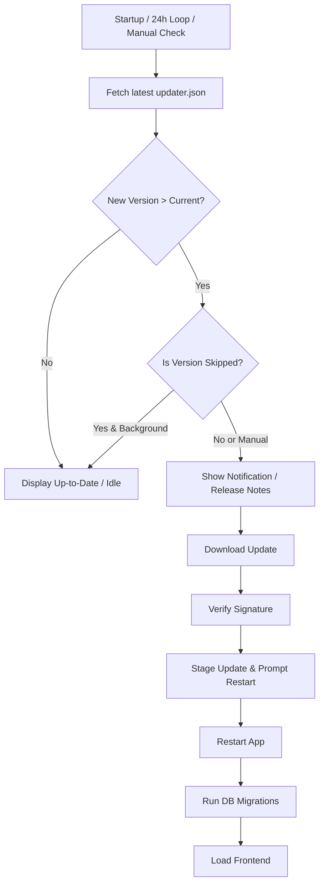

# GitHub-based Auto Update System

## Summary
Implement a secure automatic update system for Kodon using the Tauri v2 Updater plugin and GitHub Releases as the distribution channel. 

Update metadata (`updater.json`) will be generated automatically during the release workflow and published alongside signed installer artifacts as release assets. The application will check GitHub's `latest/download` endpoint for newer versions, verify signatures using Tauri's public key infrastructure, download the update with progress reporting, and prompt the user to restart. A strict synchronous database migration step on startup ensures the local SQLite state never crashes a newly updated binary.

This system eliminates manual update downloads while keeping infrastructure costs at zero.

## Problem Frame
**Current state**
*   The application version is static.
*   Users must manually download installers from GitHub Releases.
*   There is no notification mechanism for security fixes, bug fixes, or new features.
*   Version bumps do not currently handle local database schema changes safely.

**User pain**
Users remain on outdated versions because updates require manual effort, leading to version fragmentation, missed features, and higher support overhead. 

**Why now**
As Kodon becomes more stable and feature-rich, a reliable, frictionless update pipeline is essential for shipping fixes quickly and keeping the user base unified on the latest release.

## Goals
*   Provide cryptographically signed updates verified by Tauri's native tools.
*   Automate update metadata generation and release publishing through GitHub Actions.
*   Ensure safe local state transitions (SQLite schema migrations) across version bumps.
*   Add an in-app *Check for Updates* interface for manual triggering.
*   Support periodic background checks that do not interrupt or steal focus.
*   Display release notes, download progress, and restart prompts.
*   Persist user preferences for skipped versions.

## Non-goals
*   Running a custom update server.
*   Supporting unofficial distribution channels.
*   Delta/patch updates.
*   Enterprise-managed update policies.

## Requirements
*   **R1.** The app checks for updates once on startup and at most once every 24 hours while running.
*   **R2.** Users can manually trigger a check for updates from the Settings menu.
*   **R3.** Update artifacts must be cryptographically signed using Tauri's updater signing key.
*   **R4.** Background checks MUST NOT steal window focus or spawn intrusive modals. They should manifest as a UI badge or subtle non-blocking toast.
*   **R5.** Download progress (percentage and size) must be displayed during the update download.
*   **R6.** After staging completes, the app must present a clear *Restart to Apply Update* prompt.
*   **R7.** Invalid signatures must immediately abort the installation and display a security error.
*   **R8.** Users can choose to "Skip This Version," which must be persisted locally so the 24-hour background loop ignores that specific version tag in the future.
*   **R9.** Network failures during background checks must fail silently; network failures during manual checks should display a retry option.
*   **R10.** The Rust backend MUST execute SQLite schema migrations synchronously before the Tauri frontend is allowed to render, ensuring backward database compatibility with the new binary.

## Success Criteria
*   Pushing a release tag (e.g., `v0.2.0`) automatically builds, signs, generates `updater.json`, and uploads all assets to GitHub Releases without manual intervention.
*   Running `v0.1.0` successfully resolves the `latest/download/updater.json` URL via 302 redirect and detects `v0.2.0`.
*   A post-update app launch successfully migrates an older SQLite schema to the new schema without crashing.
*   Skipping a version successfully prevents background notifications for that version.
*   Tampered or unsigned installers are cleanly rejected by the Rust backend before staging.

## Key Technical Decisions

**GitHub Releases as the Update Source via `latest/download`**
Do not store `updater.json` in the main branch. Instead:
*   Generate `updater.json` dynamically during the GitHub Actions release workflow.
*   Upload it as a GitHub Release asset alongside the installers.
*   Configure Tauri to poll GitHub's undocumented latest release redirect: `https://github.com/OWNER/REPO/releases/latest/download/updater.json`
*   *Crucial Detail:* Ensure the Tauri HTTP client is configured to follow 302 redirects to bypass standard API rate limits.

**Post-Update Database Migrations**
A successful update changes the binary but leaves the old SQLite database untouched on disk. If `v0.2.0` relies on a new database column that `v0.1.0` lacked, the app will white-screen on launch. 
*   Implement a strict migration manager (e.g., via `rusqlite_migration`).
*   On application startup, Rust will check the SQLite `user_version` PRAGMA and sequentially apply all missing SQL patches before invoking `tauri::Builder::default().run()`.

**Tauri v2 Updater Plugin**
*   Rust: `tauri-plugin-updater`
*   Frontend: `@tauri-apps/plugin-updater`
*   *Crucial Detail:* **Capabilities** must be explicitly configured in `src-tauri/capabilities/default.json` to grant the updater plugin permission to reach the network and execute installations. 

**Windows Installer Format**
Standardize on NSIS for Windows releases. It provides better compatibility with Tauri's in-place upgrade flow and simpler restart-and-apply behavior compared to MSI.

## High-Level Design

**Data Flow**


**Component Architecture**

```text
src/
├── components/
│   └── settings/
│       ├── SettingsModal.jsx
│       └── UpdateTab.jsx
└── utils/
    └── updater.js           # Plugin wrappers and state management

src-tauri/
├── Cargo.toml
├── tauri.conf.json
├── capabilities/
│   └── default.json        # Plugin permissions
└── src/
    ├── lib.rs
    └── db/
        └── migrations.rs   # Schema versioning and migration logic

```

## UX Behavior

**Active vs. Passive Checks**

* **Passive (Startup/24h):** If an update is found, show a subtle notification dot on the Settings gear or tray icon. Do not show a modal.
* **Active (Manual):** If the user clicks "Check for Updates" inside Settings, show the UI modal immediately.

**Update Available Modal**

> **Current Version:** v0.1.0
> **Version v0.2.0 is available.**
> **What's New**
> * Faster reminder scheduling
> * Daily accountability check-in
> * Bug fixes
> 
> 
> `[ Download & Install ]` `[ Remind Me Later ]` `[ Skip This Version ]`

**Downloading State**
Display smooth progress reporting to reassure the user:

> Downloading update...
> ███████████░░░░░░ 63%
> 12.4 MB / 19.8 MB

**Failure Behavior**

* **No internet / Timeout:** Silently fail for background loops; show retry option for manual checks.
* **Signature mismatch:** Abort update, discard file, and display security warning.
* **Corrupted download:** Discard staged update and allow retry.
* **Restart failure:** Allow manual restart later.

## Security Model & Release Workflow

**Signing**
Generate a Tauri updater keypair using `npx tauri signer generate`. Store `TAURI_SIGNING_PRIVATE_KEY` and `TAURI_SIGNING_PRIVATE_KEY_PASSWORD` as protected GitHub Repository Secrets. Embed the public key in `tauri.conf.json`.

**Workflow Protection**
Release workflows must:

* Run only on signed tags created by maintainers.
* Use protected GitHub Actions secrets.
* Publish the release only after successful signing.

**CDN Propagation Delay (Maintainer Note)**
GitHub's `latest/download` endpoint is heavily cached by a global CDN. It can take **5 to 15 minutes** after a GitHub Action release completes for the `updater.json` to correctly reflect the new version to clients. Maintainers should account for this delay before assuming a release pipeline failed.

## Scope Boundaries

**In Scope**

* Windows auto-update using NSIS (`.exe`).
* Linux auto-update using AppImage (`.AppImage`), which supports Tauri's in-place updater.
* GitHub Release-hosted metadata via 302 redirects.
* UI for release notes, progress reporting, and restart application flow.
* Automatic background + manual update checks.
* Skipped version persistence.
* Local SQLite schema migrations.

**Out of Scope**

* macOS notarization workflow (to be handled in a separate ticket).
* Linux `.deb` / `.rpm` updates (these must be updated via the user's native system package manager, auto-updater will be disabled for these targets).
* Differential/delta updates.

## Implementation Units

**U1. Generate Signing Keys**

* Generate Tauri updater keypair.
* Store private key and password in GitHub Secrets.
* Embed public key in `tauri.conf.json`.

**U2. Configure Updater Plugin & Capabilities**

* Add `tauri-plugin-updater` to `Cargo.toml`.
* Set updater endpoint to GitHub's `latest/download/updater.json`.
* Add required permissions to `capabilities/default.json`.
* Standardize Windows target to NSIS in `tauri.conf.json`.

**U3. Release Workflow**

* Create `.github/workflows/release.yml`.
* Trigger on version tags.
* Build release artifacts and sign update bundles.
* Generate `updater.json` dynamically.
* Upload installers and metadata to GitHub Releases atomically.

**U4. Post-Update Data Migrations**

* Create `src-tauri/src/db/migrations.rs`.
* Implement a system to check the SQLite schema version on app initialization.
* Write blocking logic to execute pending SQL migrations before the Tauri webview is loaded to prevent frontend panics on new versions.

**U5. Frontend UI & State Management**

* Create `SettingsModal.jsx` and `UpdateTab.jsx`.
* Implement state machine: `idle` -> `checking` -> `up-to-date` | `available` -> `downloading` -> `ready-to-restart` | `error`.
* Implement local storage persistence for the `skipped_version` key.
* Implement passive notification badge logic.
