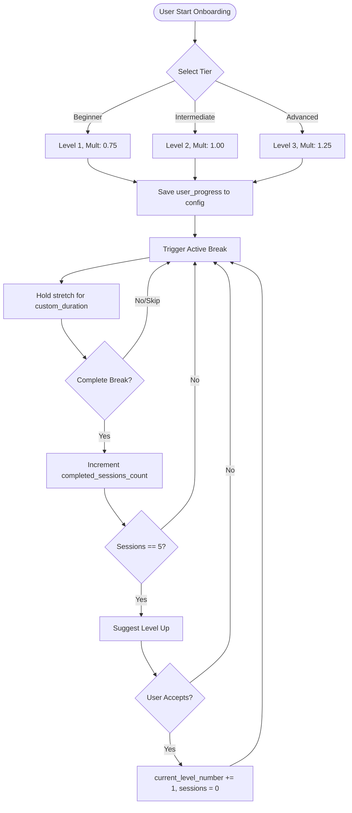

# Specification: Physical Movement Tracks & Progress Tracking

This document specifies the progressive stretching levels, data structures, and onboarding/progression logic for physical tracks (specifically the **Side Splits** track) in the Workout & Break Reminder app.

---

## 1. Side Splits Level Progression

Achieving a side (middle) split requires progressive adductor and hip opening, moving from fully supported gravity-assisted stretching to active unilateral and bilateral holds. 

Below is the standard 4-level progression designed for safety and biological adaptation.

| Level | Title | Description & Form Cues | Default Duration | Target Asset |
| :--- | :--- | :--- | :---: | :--- |
| **1** | **Wall Straddle** | Lie flat on your back with your glutes pressed against the wall, legs pointing straight up. Slowly allow your legs to slide open sideways into a wide 'V' shape, letting gravity pull them down. Keep knees fully locked and toes flexed back toward shins. Relax upper body, keep lower back flat on the floor, and breathe deeply. | 60s | `assets/stretches/wall-straddle.png` |
| **2** | **Half Split** | Start on all fours. Extend your right leg straight out to the side, keeping the inner edge of your foot flat on the floor. Keep your left knee directly under your left hip at a 90-degree angle. Lower hands or forearms to the floor. Keeping your back flat, gently rock your hips backward toward your left heel, then forward. Hold the end range. Repeat on the left side. | 60s (30s/side) | `assets/stretches/half-split.png` |
| **3** | **Frog Stretch** | Begin on hands and knees. Slide your knees out to the sides as wide as comfortable. Bend your knees at a 90-degree angle and flex your feet so your inner shins and ankles rest on the floor (toes pointing outward). Lower down to your forearms. Keep your spine neutral and core lightly engaged. Slowly press your hips back toward your heels until you feel a deep stretch in the groin. | 45s | `assets/stretches/frog-stretch.png` |
| **4** | **Side Split** | From a standing wide-legged stance, place your hands on the floor for support. Slowly slide your feet out to the sides, keeping your legs straight and kneecaps pointing up or forward. Lower down onto your hands, blocks, or forearms. Keep hips aligned vertically with heels. Flex your quadriceps and glutes to active-stabilize the joints. | 45s | `assets/stretches/side-split.png` |

---

## 2. JSON Schema for `workout-config.json`

Physical tracks and user progress are stored under the `tracks` and `user_progress` objects in the AppData config file (`workout-config.json`). This schema aligns with the snake_case naming conventions of the Rust backend.

### 2.1 JSON Schema Definition

```json
{
  "$schema": "http://json-schema.org/draft-07/schema#",
  "title": "WorkoutConfig",
  "type": "object",
  "properties": {
    "settings": {
      "type": "object",
      "properties": {
        "micro_break_interval_mins": { "type": "integer", "minimum": 1 },
        "active_break_interval_mins": { "type": "integer", "minimum": 1 },
        "micro_break_duration_secs": { "type": "integer", "minimum": 5 },
        "active_break_duration_secs": { "type": "integer", "minimum": 10 }
      },
      "required": [
        "micro_break_interval_mins",
        "active_break_interval_mins",
        "micro_break_duration_secs",
        "active_break_duration_secs"
      ]
    },
    "active_recall_cards": {
      "type": "array",
      "items": {
        "type": "object",
        "properties": {
          "id": { "type": "string" },
          "question": { "type": "string" },
          "answer": { "type": "string" },
          "category": { "type": "string" },
          "source": { "type": ["string", "null"] }
        },
        "required": ["id", "question", "answer", "category"]
      }
    },
    "reflection_prompts": {
      "type": "array",
      "items": { "type": "string" }
    },
    "tracks": {
      "type": "array",
      "items": {
        "type": "object",
        "properties": {
          "id": { "type": "string" },
          "name": { "type": "string" },
          "description": { "type": "string" },
          "levels": {
            "type": "array",
            "items": {
              "type": "object",
              "properties": {
                "level_number": { "type": "integer", "minimum": 1 },
                "title": { "type": "string" },
                "description": { "type": "string" },
                "target_duration_secs": { "type": "integer", "minimum": 10 },
                "asset_url": { "type": ["string", "null"] }
              },
              "required": ["level_number", "title", "description", "target_duration_secs"]
            }
          }
        },
        "required": ["id", "name", "description", "levels"]
      }
    },
    "user_progress": {
      "type": "object",
      "properties": {
        "active_track_id": { "type": ["string", "null"] },
        "current_level_number": { "type": ["integer", "null"], "minimum": 1 },
        "onboarding_tier": { 
          "type": ["string", "null"], 
          "enum": ["beginner", "intermediate", "advanced", null] 
        },
        "completed_sessions_count": { "type": "integer", "minimum": 0 },
        "last_completed_at": { "type": ["string", "null"], "format": "date-time" },
        "level_started_at": { "type": ["string", "null"], "format": "date-time" }
      },
      "required": [
        "active_track_id",
        "current_level_number",
        "onboarding_tier",
        "completed_sessions_count",
        "last_completed_at",
        "level_started_at"
      ]
    }
  },
  "required": [
    "settings",
    "active_recall_cards",
    "reflection_prompts",
    "tracks",
    "user_progress"
  ]
}
```

### 2.2 Config Example (`workout-config.json`)

```json
{
  "settings": {
    "micro_break_interval_mins": 20,
    "active_break_interval_mins": 50,
    "micro_break_duration_secs": 20,
    "active_break_duration_secs": 300
  },
  "active_recall_cards": [
    {
      "id": "card_rust_lifetime",
      "question": "What is a Lifetime in Rust?",
      "answer": "A lifetime is a construct the compiler uses to ensure all borrows are valid and that data isn't dropped while it's still being used.",
      "category": "Rust",
      "source": "https://doc.rust-lang.org/book/ch10-03-lifetime-syntax.html"
    }
  ],
  "reflection_prompts": [
    "What is the core problem you are solving right now? Is there a simpler way?"
  ],
  "tracks": [
    {
      "id": "side_splits",
      "name": "Side Splits",
      "description": "Progressive stretching track to achieve a full side (middle) split.",
      "levels": [
        {
          "level_number": 1,
          "title": "Wall Straddle",
          "description": "Lie flat on your back with your glutes pressed against the wall, legs pointing straight up. Slowly allow your legs to slide open sideways into a wide 'V' shape, letting gravity pull them down. Keep knees fully locked and toes flexed back toward shins. Relax upper body, keep lower back flat on the floor, and breathe deeply.",
          "target_duration_secs": 60,
          "asset_url": "assets/stretches/wall-straddle.png"
        },
        {
          "level_number": 2,
          "title": "Half Split",
          "description": "Start on all fours. Extend your right leg straight out to the side, keeping the inner edge of your foot flat on the floor. Keep your left knee directly under your left hip at a 90-degree angle. Lower hands or forearms to the floor. Keeping your back flat, gently rock your hips backward toward your left heel, then forward. Hold the end range. Repeat on the left side.",
          "target_duration_secs": 60,
          "asset_url": "assets/stretches/half-split.png"
        },
        {
          "level_number": 3,
          "title": "Frog Stretch",
          "description": "Begin on hands and knees. Slide your knees out to the sides as wide as comfortable. Bend your knees at a 90-degree angle and flex your feet so your inner shins and ankles rest on the floor (toes pointing outward). Lower down to your forearms. Keep your spine neutral and core lightly engaged. Slowly press your hips back toward your heels until you feel a deep stretch in the groin.",
          "target_duration_secs": 45,
          "asset_url": "assets/stretches/frog-stretch.png"
        },
        {
          "level_number": 4,
          "title": "Side Split",
          "description": "From a standing wide-legged stance, place your hands on the floor for support. Slowly slide your feet out to the sides, keeping your legs straight and kneecaps pointing up or forward. Lower down onto your hands, blocks, or forearms. Keep hips aligned vertically with heels. Flex your quadriceps and glutes to active-stabilize the joints.",
          "target_duration_secs": 45,
          "asset_url": "assets/stretches/side-split.png"
        }
      ]
    }
  ],
  "user_progress": {
    "active_track_id": "side_splits",
    "current_level_number": 1,
    "onboarding_tier": "beginner",
    "completed_sessions_count": 0,
    "last_completed_at": null,
    "level_started_at": "2026-08-01T00:00:00Z"
  }
}
```

---

## 3. Onboarding & Progression Logic

### 3.1 Onboarding Initialization

During the first-time run, the user is presented with an onboarding screen asking them to self-select their starting flexibility tier. The choice is serialized into `user_progress` based on the mapping below.

#### Starting Level Mapping
- **Beginner**: Start at **Level 1 (Wall Straddle)**. Fully supported, passive, low injury risk.
- **Intermediate**: Start at **Level 2 (Half Split)**. Introduction to active/unilateral stretching.
- **Advanced**: Start at **Level 3 (Frog Stretch)**. Intensive adductor stretch requiring hip control.

#### Static Level Durations
To simplify timer logic and keep durations transparent, the chosen difficulty tier does not scale hold times. Stretches are held for their default `target_duration_secs` as defined statically in the track configurations (e.g. 30s, 45s, 60s, or 90s).

The difficulty tier (Beginner/Intermediate/Advanced) is used purely to filter which exercises are mapped into the user's progression (i.e. Intermediate users get Intermediate and Beginner exercises; Advanced users get all exercises).

---

### 3.2 Progression Logic (Leveling Up)

To gamify progress and guarantee physical adaptation, progression is tracked via completed active break sessions.



1. **Incrementing Session Count**: Every time the user completes an active break containing their physical track stretch, increment `completed_sessions_count` by `1` and update `last_completed_at`.
2. **Level Up Trigger**: Upon reaching **5 completed sessions** at the current level, display a level-up prompt at the end of the active break:
   - *"Congrats on completing 5 sessions of [Current Level]! Ready to progress to [Next Level]?"*
3. **User Action**:
   - **Accept**: Sets `current_level_number += 1`, resets `completed_sessions_count = 0`, and updates `level_started_at`.
   - **Decline/Snooze**: Retains the current level and allows manual progression later via the Settings tab.
4. **Manual Settings Override**: A dedicated section under the settings panel lets the user manually change their `current_level_number` (1 to 4) or change their `onboarding_tier` at any time.
