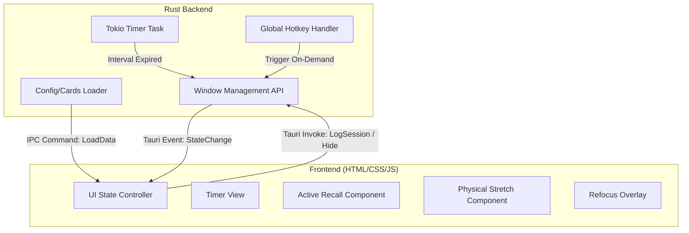

# Technical Specification: Workout & Break Reminder (Cognitive Companion)

This document specifies the implementation plan for the Tauri v2 + Rust + HTML/CSS/JS Workout & Break Reminder desktop application.

---

## 1. System Architecture



### 1.1 Rust Backend Responsibilities
- **Background Timer**: A tokio task tracking time elapsed. Highly reliable even if the frontend window is closed or hidden.
- **Global Hotkey Registration**: Registers `Ctrl + Alt + R` using Tauri's global shortcut capability.
- **Window Control**: 
  - Toggles the main window between hidden (background state) and visible/always-on-top (break state).
  - Switches visual states (e.g. transparent click-through, full screen, dimmed black opacity).
- **Local Storage**: Reads/writes a `cards.json` or `config.json` file in the user's AppData directory.

### 1.2 Frontend Responsibilities
- **Core SPA Layout**: Single Page App styled with vanilla CSS implementing the **Obsidian Kinetic** theme tokens (charcoal bases, Ignition Orange interactive borders, Terminal Green success indicators).
- **Sound and Animations**: Triggering soft warning sound cues (optional) and micro-animations for timers.
- **Study & Stretch Presentation**: Pulls reflection questions and active recall prompts from the backend payload.

---

## 2. Break Cycles & Window Behavior

| Cycle | Trigger | Duration | Screen/Window Behavior | Frontend View |
| :--- | :--- | :--- | :--- | :--- |
| **Micro-Break** | Every 20 mins | 20s | Full Screen, Always-on-Top, Absolute Black opacity (dimmed screen), disables click-through but intercepts inputs to prevent cognitive usage. | No text, just a very subtle progress bar indicating remaining seconds. |
| **Active Break** | Every 50 mins | 5 mins | Full Screen or Centered overlay window, Always-on-Top, charcoal backdrop with outlines. | Guided stretch routine (left panel) + Active Recall flashcard (right panel) + triage buttons. |
| **Refocus Break** | `Ctrl + Alt + R` | 5 mins | Centered Overlay Window, always-on-top. | Cognitive reflection prompts + text input box for journaling/rubber-ducking. |

---

## 3. Configuration & Flashcard Data Structure
Config is stored in the user's App Data directory as `workout-config.json`.

```json
{
  "settings": {
    "microBreakIntervalMins": 20,
    "activeBreakIntervalMins": 50,
    "microBreakDurationSecs": 20,
    "activeBreakDurationSecs": 300
  },
  "activeRecallCards": [
    {
      "id": "1",
      "question": "What is a Lifetime in Rust?",
      "answer": "A lifetime is a construct the compiler uses to ensure all borrows are valid and that data isn't dropped while it's still being used.",
      "category": "Rust",
      "source": "https://doc.rust-lang.org/book/ch10-03-lifetime-syntax.html"
    }
  ],
  "reflectionPrompts": [
    "What is the core problem you are solving right now? Is there a simpler way?",
    "Are you stuck down a rabbit hole? Zoom out and state your goal in one sentence.",
    "Is there a simpler data structure or logic block that solves this?"
  ],
  "stretches": [
    {
      "name": "Physical Reset",
      "description": "Quick desk-side mobility routine to realign posture and improve blood flow.",
      "durationSecs": 30,
      "imageUrl": "assets/stretches/physical-reset.png"
    }
  ]
}
```

---

## 4. Implementation Steps

### Phase 1: Rust Backend & Tauri Setups
1. Initialize the global shortcut plugin for `Ctrl+Alt+R`.
2. Configure `tauri.conf.json` window parameters (hidden by default, transparent, no decorations, customizable sizes).
3. Create Rust helper modules for:
   - Config file loading and saving.
   - Spawning the tokio background timer state machine.
4. Set up Tauri commands for:
   - `get_config`, `save_config`.
   - `log_session` (recording "Done" vs "Skipped").
   - `hide_window` (to hide the break overlay).

### Phase 2: Design System & Styling
1. Create `src/styles.css` containing Obsidian Kinetic design system tokens (colors, typography, pill rounding).
2. Wire custom fonts (Geist, JetBrains Mono).

### Phase 3: Frontend Views
1. Build the main layout (`index.html`) with three view containers:
   - **Micro-Break screen**: Black background, simple countdown.
   - **Active Break screen**: Dual-panel design matching `code.html`.
   - **Refocus screen**: Reflection prompt overlay.
2. Build `src/main.js` to manage UI view switching, timer ticking, revealing answers, and calling backend Tauri commands.

### Phase 4: Integration & Telemetry
1. Bind Tauri Rust events to automatically trigger the frontend overlays when timers run out.
2. Bind the global shortcut `Ctrl+Alt+R` in Rust to summon the Refocus overlay.
3. Test locally and compile binary.
